# 📈 Documentação de Escalabilidade — Bolão como Plataforma Multi-Grupo

> **Objetivo:** sair de **1 bolão fechado com 4 amigos** para uma **plataforma de bolões para parceiros** (hamburguerias, bares, lojas, empresas), onde cada parceiro cria seu grupo, distribui um **código de entrada**, e os clientes palpitam, sobem no ranking do grupo e ganham **prêmios/cupons no WhatsApp**.

Este documento descreve a **visão**, a **arquitetura alvo**, o **modelo de dados multi-tenant**, os **gargalos de escala** (com destaque para o WhatsApp) e um **roadmap de infraestrutura por fases**, do estado atual (tudo em tier gratuito) até milhares de usuários.

---

## 1. Visão geral e modelo de negócio

```mermaid
flowchart LR
    P[🍔 Parceiro<br/>hamburgueria, bar, loja] -->|cria grupo| G[👥 Grupo / Bolão]
    G -->|gera código + QR| C[🎟️ Código de entrada]
    C -->|cliente escaneia/digita| U[📱 Cliente]
    U -->|nome + telefone| J[Entra no grupo]
    J --> B[Palpita nos jogos]
    B --> R[🏆 Ranking do grupo]
    R -->|acertou / venceu| PR[🎁 Prêmio / Cupom]
    PR -->|entregue por| W[💬 WhatsApp]
    W -->|cliente volta à loja| P

    style P fill:#ffe066,stroke:#c58c00,color:#000
    style PR fill:#ffd6d6,stroke:#c00,color:#000
    style W fill:#d6ffd6,stroke:#0a0,color:#000
```

**Ciclo de valor:** o parceiro ganha **recorrência e engajamento** (cliente volta para resgatar o prêmio), a plataforma ganha por **mensalidade/comissão por grupo** ou **patrocínio**, e o cliente ganha **diversão + prêmio**. É um motor de fidelização "plug-and-play" em cima dos jogos da Copa (e, no futuro, de qualquer campeonato).

### Conceitos novos (multi-tenant)

| Conceito | O que é | Hoje |
|---|---|---|
| **Parceiro (Partner)** | Dono comercial de um ou mais grupos (a hamburgueria) | ❌ não existe |
| **Grupo / Bolão (Group)** | Um bolão isolado, com seu ranking, regras e prêmios | ⚠️ existe **1 implícito** (global) |
| **Membro (Membership)** | Vínculo de um usuário a um grupo | ⚠️ `participants` fixos |
| **Usuário (User)** | Pessoa identificada por **telefone** | ⚠️ 4 logins fixos |
| **Prêmio/Cupom (Reward)** | Recompensa entregue por critério | ❌ não existe |

---

## 2. Estado atual × Estado alvo

### 2.1 Arquitetura atual (single-tenant)

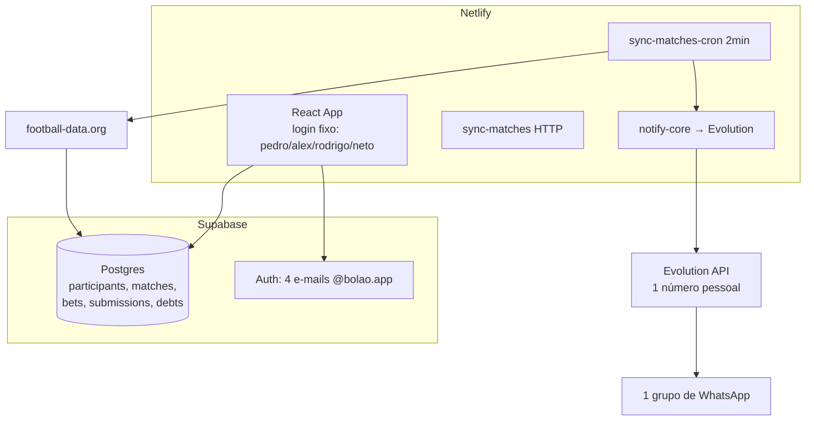

**Limites do modelo atual:**
- Ranking é **global** e calculado **no navegador** sobre *todos* os palpites → não isola grupos e não escala.
- Auth é **4 e-mails fixos** semeados à mão → não dá para auto-cadastro.
- WhatsApp = **1 número pessoal** num **único grupo** → não cobre N grupos nem envio individual de prêmios.
- Sem conceito de parceiro, código de entrada, prêmio.

### 2.2 Arquitetura alvo (multi-tenant)

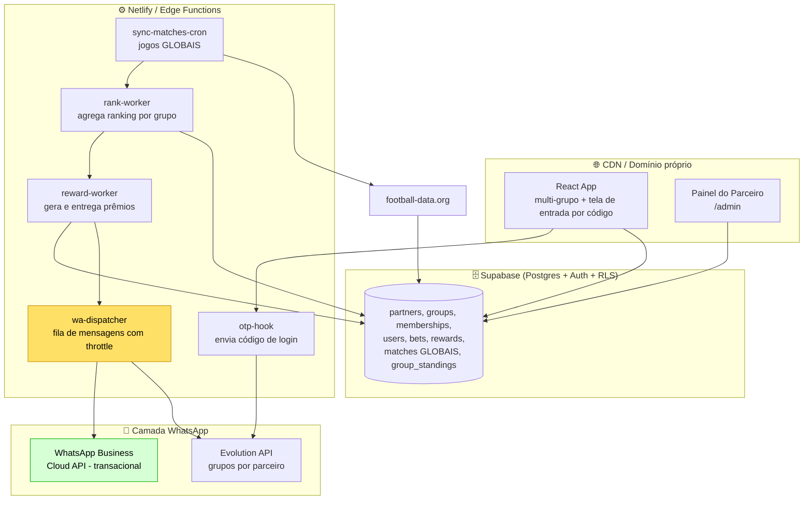

**Mudanças-chave:**
1. **Multi-tenant no banco** (grupos isolados por RLS).
2. **Ranking por grupo**, agregado **no servidor** (worker), não no cliente.
3. **Auth por telefone** com OTP entregue via WhatsApp.
4. **Fila de mensagens** com throttle (proteção contra ban do WhatsApp).
5. **Painel do parceiro** para gerir grupo, prêmios e branding.

---

## 3. Jornada do usuário (onboarding por código)

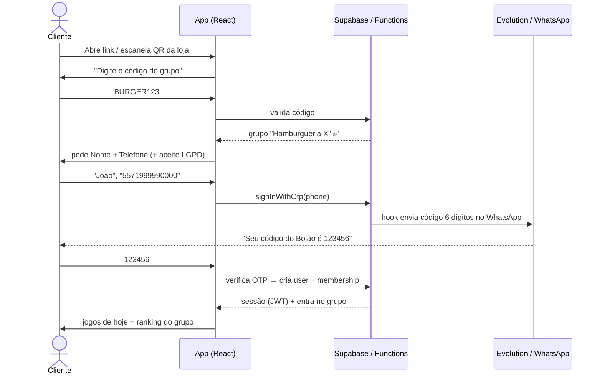

**Por que telefone + OTP (e não e-mail/senha)?**
- Fricção mínima (cliente na loja não quer criar conta).
- O telefone **já é o canal de prêmio** (WhatsApp) — verificá-lo é essencial.
- Reaproveita a **Evolution que já temos** para enviar o OTP (custo ~zero), sem precisar de SMS pago (Twilio).

> 🔧 **Como implementar:** Supabase Auth tem **Phone Auth** com **"Send SMS Hook"** — uma Edge Function que você controla. Em vez de mandar SMS, o hook chama a Evolution e manda o código pelo WhatsApp. Migra suave a partir do que já existe em [`netlify/shared/notify-core.mts`](../netlify/shared/notify-core.mts).

---

## 4. Modelo de dados multi-tenant

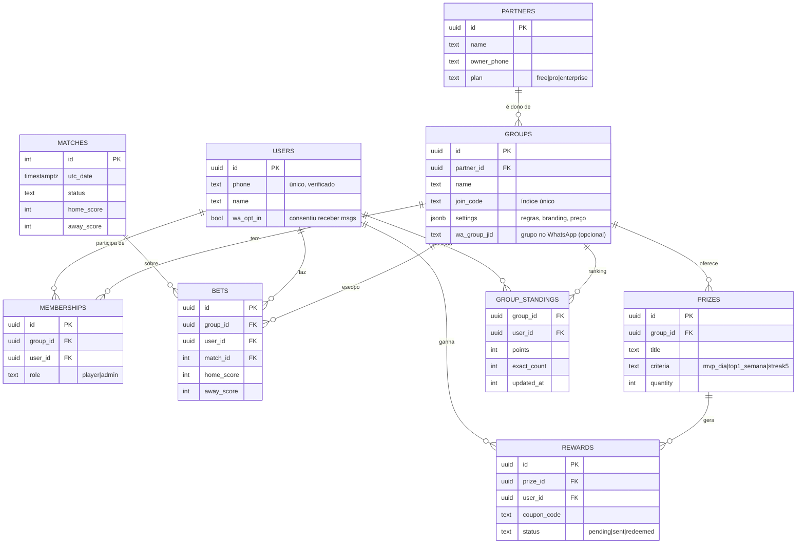

### Princípios do schema

1. **`matches` continua GLOBAL** ✅ — os jogos da Copa são os mesmos para todo mundo. **Isso é ouro para escala:** o custo da football-data.org **não cresce** com o número de usuários nem de grupos (1 sync serve a plataforma inteira).
2. **`bets` ganha `group_id`** — o mesmo usuário pode palpitar em grupos diferentes. Chave única: `(group_id, user_id, match_id)`.
3. **`group_standings`** é uma tabela **materializada** (cache) — o ranking deixa de ser recalculado no navegador (ver §6).
4. **RLS por grupo** — um membro só enxerga dados do(s) grupo(s) a que pertence (ver abaixo).

### Isolamento por RLS (Row Level Security)

```sql
-- Exemplo: usuário só vê palpites dos grupos onde é membro
create policy "bets_visiveis_do_meu_grupo"
on public.bets for select
using (
  exists (
    select 1 from public.memberships m
    where m.group_id = bets.group_id
      and m.user_id = auth.uid()
  )
);
```

> A migração do schema atual é incremental: criamos `groups`/`memberships`, criamos um "grupo 0" para os 4 amigos atuais, adicionamos `group_id` em `bets`/`submissions`/`special_predictions`/`debts` apontando para esse grupo, e seguimos. **Ninguém perde histórico.** Ver §11.

---

## 5. Sistema de prêmios e cupons

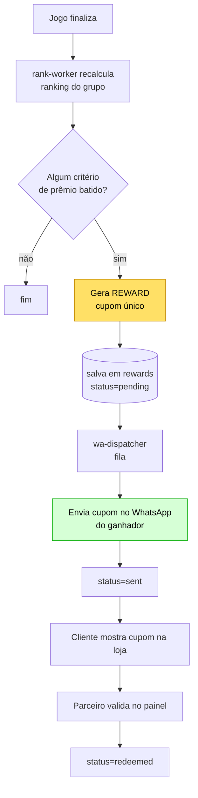

**Critérios configuráveis por grupo** (`prizes.criteria`):
- `mvp_dia` — quem mais pontuou no dia
- `top1_semana` / `top3_geral` — líderes do ranking
- `streak5` — 5 acertos seguidos (já temos a lógica "On Fire" em [`StandingsTable.tsx`](../src/components/StandingsTable.tsx))
- `placar_exato` — acertou um placar cravado

**Anti-fraude do cupom:** código único por `reward`, validade, e baixa (`redeemed`) só pelo parceiro autenticado no painel — assim o mesmo cupom não é usado 2x.

---

## 6. Escalabilidade técnica (os gargalos reais)

### 6.1 Ranking: do navegador para o servidor ⚠️ **crítico**

Hoje [`calculateStandings`](../src/utils/rules.ts) roda **no navegador de cada usuário** sobre **todos** os palpites. Com 4 pessoas, ok. Com 5.000 pessoas em 200 grupos, isso **trava o celular** e baixa dados demais.

**Solução:** mover a agregação para um **worker** (`rank-worker`) que recalcula `group_standings` quando um jogo finaliza, e o app só **lê a tabela pronta**.

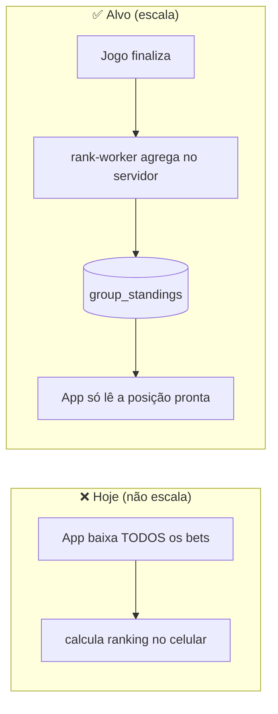

### 6.2 Tabela comparativa de limites por componente

| Componente | Escala com... | Gargalo / limite | Mitigação |
|---|---|---|---|
| **football-data.org** | nº de jogos (fixo!) | 10 req/min no free | 1 sync global serve todos; subir p/ tier pago só por confiabilidade |
| **Supabase DB** | usuários × jogos (bets) | free: 500 MB; conexões | Pro ($25); índices; particionar `bets` por competição |
| **Supabase Realtime** | conexões simultâneas | free: 200; Pro: 500+ | usar polling leve onde não precisa de realtime; só ranking via realtime |
| **Supabase Auth** | nº de usuários | free: 50k MAU | suficiente por muito tempo |
| **Netlify Functions** | invocações | free: 125k/mês | mover workers pesados p/ fila/cron; cache |
| **WhatsApp (Evolution)** | **nº de mensagens** | **BAN do número** 🚨 | **ver §7 — o maior risco** |
| **Ranking (cliente)** | nº de bets | trava o device | mover p/ servidor (§6.1) |

### 6.3 Crescimento da tabela `bets`

`bets ≈ usuários × jogos palpitados`. Copa = ~104 jogos. Com 10.000 usuários ativos → ~1M linhas. **Tranquilo para o Postgres** com índice em `(group_id, match_id)` e `(user_id)`. Particionar só vira tema com múltiplas competições/temporadas acumuladas.

---

## 7. 🚨 WhatsApp em escala — o gargalo mais importante

> **Leia esta seção antes de crescer.** O maior risco do projeto **não é** o banco nem o front — é **ter o número de WhatsApp banido** por enviar mensagem em massa por uma API não-oficial.

### 7.1 O problema

A **Evolution API** usa a biblioteca **Baileys** (WhatsApp Web não-oficial). É perfeita para **baixo volume** (nosso grupo dos 4 amigos, OTPs pontuais), mas ao mandar **muitas mensagens individuais** (cupons, lembretes para milhares), o WhatsApp **detecta padrão de spam e bane o número**. Perder o número = perder OTP **e** entrega de prêmio de uma vez.

### 7.2 Estratégia em duas camadas

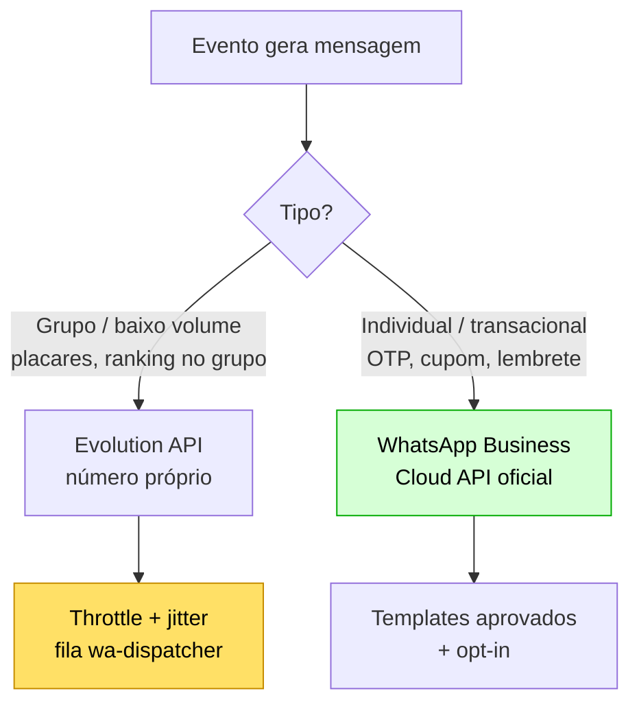

| Camada | Quando usar | Prós | Contras |
|---|---|---|---|
| **Evolution (Baileys)** | mensagens **no grupo** do parceiro, volume baixo | grátis, simples, já temos | risco de ban se abusar |
| **WhatsApp Cloud API (Meta oficial)** | **mensagens individuais** (OTP, cupom, lembrete) em escala | oficial, não bane, entregabilidade | precisa de número dedicado, verificação Meta, **templates aprovados**, custo por conversa |

**Recomendação:** começar **só com Evolution** (Fase 0–1). Assim que houver **envio individual recorrente para muita gente** (Fase 2), migrar o **transacional** para a **Cloud API**, mantendo a Evolution apenas para mensagens **dentro dos grupos**.

### 7.3 Fila com throttle (`wa-dispatcher`)

Mesmo na Evolution, **nunca** envie em rajada. Toda mensagem entra numa **fila** (tabela `wa_outbox` ou um Redis) e um worker drena com **ritmo humano** (ex.: 1 msg a cada 3–8s, com variação aleatória), respeitando **opt-in** e horário.

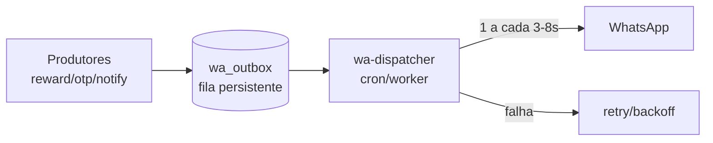

### 7.4 LGPD e consentimento (obrigatório no Brasil)

Coletar **nome + telefone** = **dado pessoal** sob a **LGPD**. Mínimo necessário:
- ✅ **Aceite explícito** no cadastro (checkbox: "aceito receber mensagens no WhatsApp e os termos").
- ✅ **Opt-out** fácil ("responda SAIR para não receber mais").
- ✅ **Política de privacidade** + finalidade declarada (bolão + prêmios).
- ✅ **Retenção/expurgo**: poder apagar o usuário e seus dados a pedido.
- ✅ Não compartilhar telefone com o parceiro além do necessário para entregar o prêmio.

---

## 8. Painel do Parceiro e Super-Admin

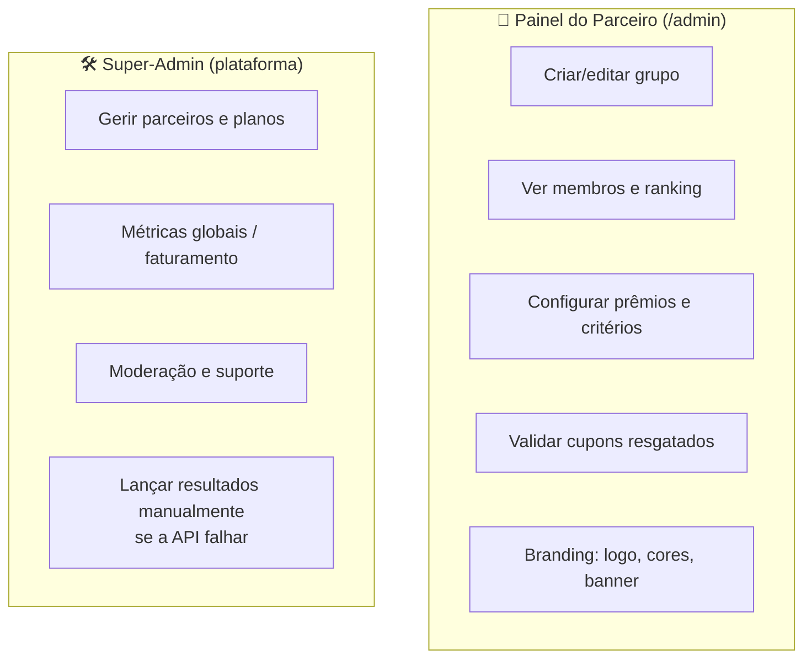

O **Super-Admin** resolve uma pendência antiga ([`PENDENCIAS.md`](../PENDENCIAS.md)): **tela de admin para lançar/corrigir resultados** quando a football-data.org falhar — essencial quando há dinheiro/prêmio em jogo.

---

## 9. Roadmap de infraestrutura por fases

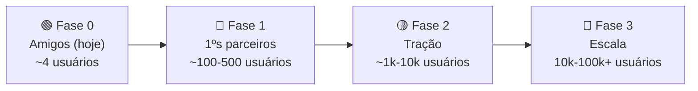

### Fase 0 — Hoje (validação, custo ~zero)
- **Front:** Netlify (free) · **Dados/Auth:** Supabase (free) · **Jogos:** football-data.org (free)
- **WhatsApp:** Evolution num VPS pequeno (já existe na easypanel) · **1 grupo**
- **Foco:** validar o produto com os 4 amigos. ✅ *é onde estamos*

### Fase 1 — Primeiros parceiros (validar o modelo de negócio)
- **Implementar multi-tenant** (grupos, código de entrada, auth por telefone, ranking no servidor).
- **Domínio próprio** (ex.: `bolao.com.br`) + HTTPS (Netlify cuida do SSL).
- **VPS dedicado para a Evolution** (estabilidade do número) — ~R$30–60/mês.
- Supabase **free** ainda aguenta. WhatsApp **só Evolution** com fila/throttle.
- **Custo estimado:** ~R$50–100/mês + domínio (~R$40/ano).

### Fase 2 — Tração (começa a dar lucro)
- **Supabase Pro** (~US$25/mês): mais conexões, backups, sem pausa por inatividade.
- **WhatsApp Business Cloud API** para o **transacional** (OTP, cupom) — fim do risco de ban.
- **football-data.org** tier pago **opcional** (dados ao vivo mais firmes).
- **Observabilidade:** logs + alertas (Sentry/Logflare), uptime monitor.
- **wa-dispatcher** com fila persistente (Supabase table ou Upstash Redis).
- **Custo estimado:** ~R$300–600/mês (escala com nº de conversas no WhatsApp).

### Fase 3 — Escala (operação séria)
- **Postgres gerenciado** robusto (Supabase scale / Neon / RDS) + **read replicas** para leitura de ranking.
- **Múltiplos números/instâncias** de WhatsApp + balanceamento; Cloud API como principal.
- **Cache/CDN** para dados quentes (ranking do grupo) — Redis + edge cache.
- **Filas dedicadas** e workers separados (não mais "tudo em function").
- **CI/CD**, ambientes (staging/prod), testes de carga, on-call.
- **Custo estimado:** R$1.500–5.000+/mês (varia muito com volume de WhatsApp).

### Tabela-resumo

| | Fase 0 | Fase 1 | Fase 2 | Fase 3 |
|---|---|---|---|---|
| Usuários | ~4 | 100–500 | 1k–10k | 10k–100k+ |
| Front | Netlify free | Netlify free | Netlify Pro | Netlify/CDN |
| Banco | Supabase free | Supabase free | Supabase Pro | Postgres gerenciado + réplicas |
| WhatsApp | Evolution | Evolution + fila | + Cloud API (transacional) | Cloud API + múltiplos números |
| Domínio | netlify.app | **próprio** | próprio | próprio |
| Ranking | cliente | **servidor** | servidor + cache | cache distribuído |
| Custo/mês | ~R$0–50 | ~R$50–100 | ~R$300–600 | R$1.5k–5k+ |

---

## 10. Observabilidade e operação

À medida que cresce, instrumentar:
- **Logs estruturados** nas functions (já há `console.log` em [`sync-core.mts`](../netlify/shared/sync-core.mts)/[`notify-core.mts`](../netlify/shared/notify-core.mts)).
- **Métricas:** msgs enviadas/falhadas, OTPs, cupons gerados/resgatados, latência da football-data.
- **Alertas:** número de WhatsApp caiu? sync falhou? fila parada?
- **Healthcheck** da Evolution (a instância desconecta às vezes — precisa reconectar o QR).
- **Backup** do Postgres (automático no Supabase Pro).

---

## 11. Plano de migração (sem quebrar o que existe)

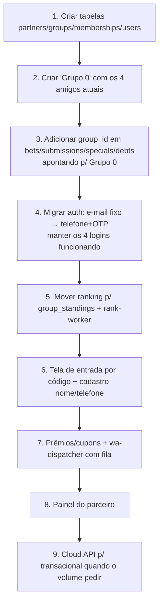

**Regra de ouro:** cada passo é uma **migration aditiva** (como as `update-00X-*.sql` que já usamos) — nada de "big bang". O bolão dos 4 amigos vira **só mais um grupo** dentro da plataforma e **nunca para de funcionar**.

---

## 12. Resumo executivo — por onde começar

Se for fazer **uma coisa de cada vez**, esta é a ordem de maior impacto:

1. 🥇 **Multi-tenant no banco** (grupos + memberships + `group_id` nas apostas) — é a fundação de tudo.
2. 🥈 **Ranking no servidor** (`group_standings`) — sem isso, o app trava com muita gente.
3. 🥉 **Auth por telefone + OTP via WhatsApp** — destrava o autocadastro por código.
4. **Fila de WhatsApp com throttle** — protege o número desde o primeiro envio em volume.
5. **Prêmios/cupons + painel do parceiro** — entrega o valor comercial.
6. **Cloud API + domínio + Supabase Pro** — quando o lucro justificar (Fase 2).

> ⚠️ **O risco nº 1 a vigiar desde já: a saúde do número de WhatsApp.** Tudo o mais é Postgres e React — problemas conhecidos e resolvidos. O WhatsApp em escala é o que exige planejamento (fila, opt-in, Cloud API). Comece com disciplina de envio mesmo com poucos usuários.
